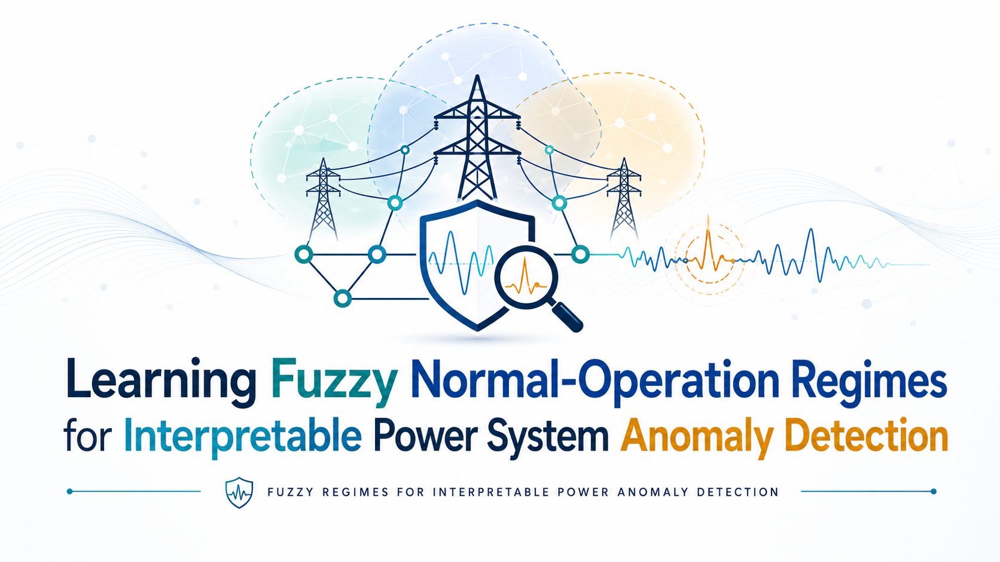

# Learning Fuzzy Normal-Operation Regimes for Interpretable Power System Anomaly Detection
<div id="top"></div>
<!-- PROJECT LOGO -->
<br />
<div align="center">
  <a href="https://github.com/Nahal9776/Interpretable-Power-System-Anomaly-Detection">
    
  </a>

  <h1 align="center"></h1>

  <p align="center">
    Learning Fuzzy Normal-Operation Regimes for Interpretable Power System Anomaly Detection
    <br />
    <a href="???"><strong>Paper Revised in Electric Power Systems Research</strong></a>
    <br />
    <br />
    <a href="https://scholar.google.com/citations?user=VG_xT0YAAAAJ&hl=en">Nahal Azadi</a>
    ·
    <a href="https://unifind.unipd.it/resource/person/495353?language=en-US">Emad Efatinasab</a>
    ·
    <a href="https://www.unipd.it/contatti/mirco.rampazzo">Mirco Rampazzo</a>
  </p>
</div>

<p align="right"><a href="#top">(back to top)</a></p>
<div id="citation"></div>

## 🗣️ Citation

Please, cite this work when referring to the paper.

```
???

```
<div id="abstract"></div>

## 🧩 Abstract

>This paper presents an interpretable one-class anomaly detection framework for power systems based on adaptive neuro-fuzzy inference systems (ANFIS). The proposed method is trained exclusively on benign operational data and learns a compact set of fuzzy regimes describing normal cyber-physical behavior. The learned regimes are used to define rule-local invariant bounds and regularized Gaussian compatibility models. A fuzzy rule-weighted Mahalanobis score then measures the compatibility of each new observation with the activated benign regimes. Unlike supervised detectors, the proposed method requires no fault or attack samples during training and evaluates anomalous observations through deviations from learned normal operation.
The framework is evaluated on the Mississippi State University and Oak Ridge National Laboratory Power System Attack Dataset, which contains benign operation, natural faults, and cyberattacks. The proposed detector achieves a ROC-AUC of 0.9773, a PR-AUC of 0.9998, precision of 0.9994, recall of 0.9265, specificity of 0.9138, and an F1-score of 0.9616. In addition to anomaly detection, the framework provides rule and feature-level explanations by identifying the activated fuzzy regime, the measurements contributing most strongly to the anomaly score, and any violated invariant conditions. The learned rules also capture distinct physical measurement profiles, supporting interpretable analysis of detected faults and attacks.

<p align="right"><a href="#top">(back to top)</a></p>
<div id="usage"></div>
